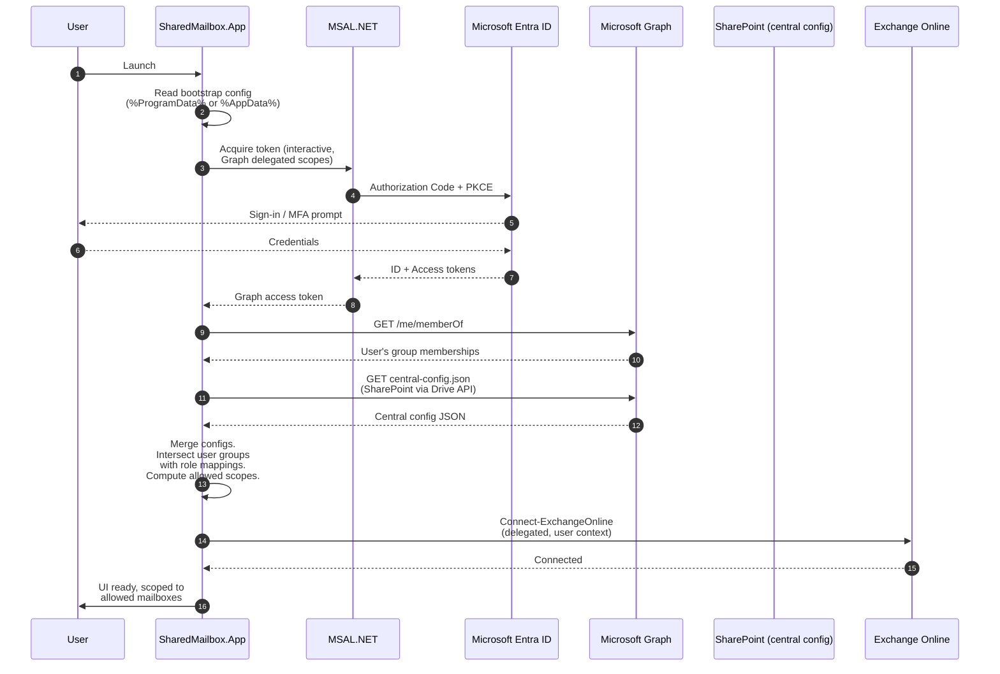
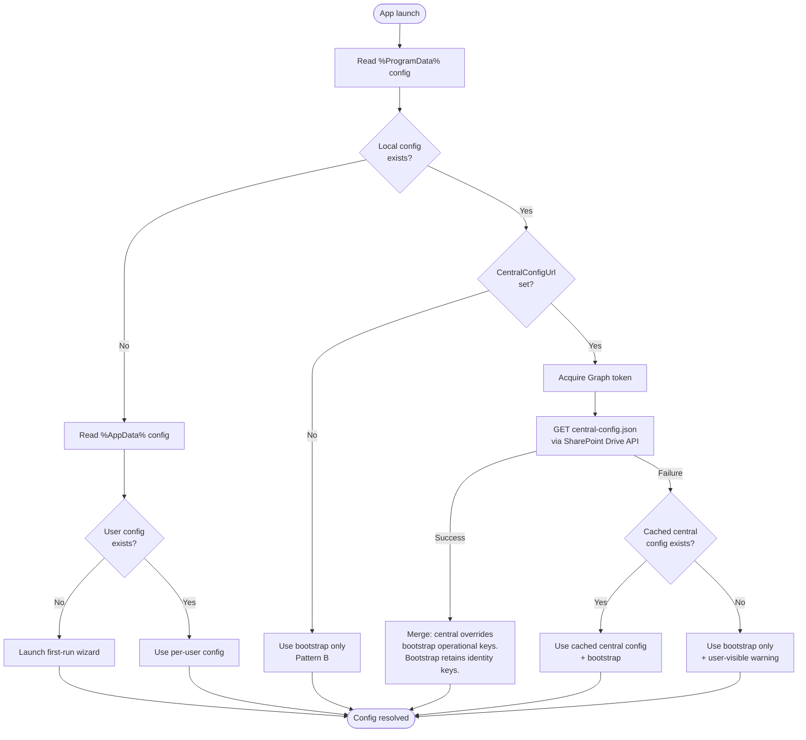
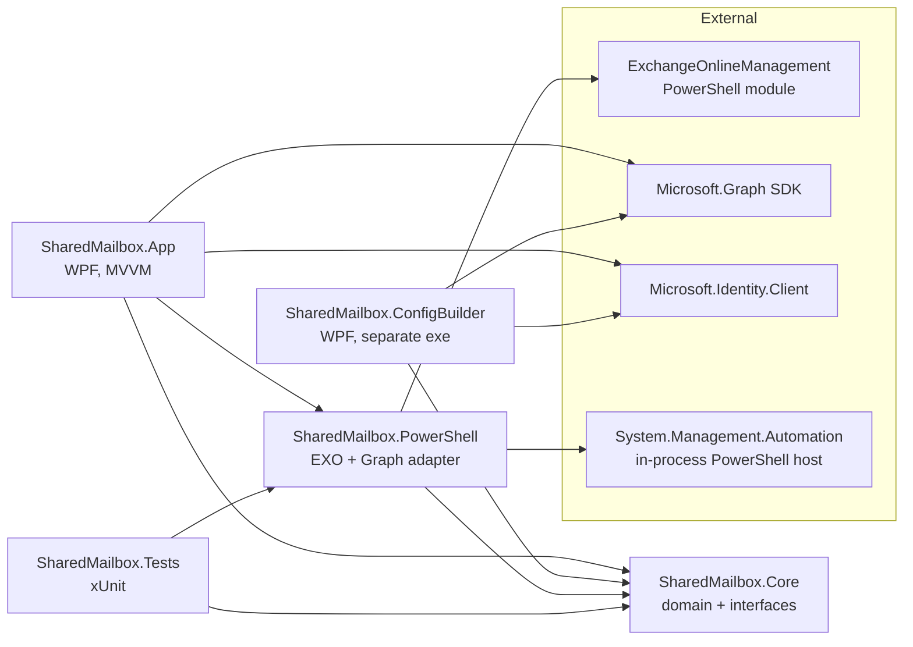

# Architecture — `entra-shared-mailbox-manager`

> A least-privilege delegation toolkit for Microsoft 365 shared mailboxes. This document is the design source-of-truth for the v2 product — the security model, identity and authorization design, configuration architecture, deployment patterns, and component layout. It is intended to be read by the engineer building the tool, the administrator deploying it, and any reviewer evaluating the design.

---

## 1. Purpose of this document

This document captures *why* the tool is built the way it is — the decisions, the trade-offs, the things considered and rejected. It is **not** a user manual (see [`../README.md`](../README.md)) and **not** a deployment runbook (see `Setup.md`, forthcoming). It is the durable record of architectural intent. When future contributors ask "why did you do it that way?", this document is the answer.

---

## 2. Problem statement

### 2.1 Why this tool exists

Managing shared mailbox delegations in Microsoft 365 is a chronic operational pain point in mid-size and large tenants. The default path — the Exchange admin center web UI — has three structural problems:

- **It does not scale.** Every change is one-shared-mailbox-at-a-time. Onboarding a new employee onto twenty team shared mailboxes is forty clicks, minimum. Offboarding a departing employee is worse, because the admin first has to discover every mailbox the user was a delegate on.
- **It has no delegation model for team leads.** A Project Manager who owns five team shared mailboxes cannot grant themselves a way to add and remove their own people from their own mailboxes without being given a tenant-wide Exchange admin role. So either the IT helpdesk becomes the bottleneck for every membership change, or PMs are over-privileged and can edit mailboxes outside their team.
- **It leaves orphaned permissions behind.** When a user is offboarded and their Entra sign-in is blocked, their mailbox delegations are not automatically cleaned up. Over time, every shared mailbox accretes a layer of dead delegates. There is no built-in UI to find or clean these up at scale.

A custom tool can solve all three. This project is that tool.

### 2.2 Why the v1 PowerShell script was no longer enough

A PowerShell script ([`../legacy/shared-mailbox-manager.ps1`](../legacy/shared-mailbox-manager.ps1)) solved the bulk-grant and audit problems for one tenant for roughly a year. It is good at what it does, but it has four structural limits that no amount of further scripting will fix:

1. **It is single-tenant by construction.** The list of known SharedMail- security groups is hardcoded. To deploy elsewhere, the script must be edited.
2. **It cannot be delegated safely.** The script enforces no authorization itself — it runs in whatever Exchange context the operator already has. Giving it to a Project Manager means giving the PM tenant-wide Exchange admin rights, which is precisely what we are trying to avoid.
3. **It is not deployable in the modern Windows sense.** Distributing a `.ps1` file to non-admin team leads via Intune is technically possible but operationally awkward — execution policy, signing, file-path discovery, and PowerShell module dependencies all have to be managed per-machine.
4. **The UX limit is real.** A console prompt that asks an operator to pick a number from a menu is fine for IT admins. It is not fine for a Project Manager who needs to add a contractor to their team mailbox at 8:30am on a Monday.

The v2 product is therefore not "the script, but a GUI" — it is a reconception of the same operations under a real security model.

---

## 3. Goals and non-goals

### 3.1 Goals

- **Real least-privilege delegation.** A team manager can administer *their own team's* shared mailboxes without holding any tenant-wide admin role. The boundary is enforced by Microsoft 365 itself, not by the tool.
- **Cross-tenant portability.** The same compiled binary works in any Microsoft 365 tenant, given a configuration drop. No tenant-specific data is baked into the code or the package.
- **Centrally-managed configuration with live updates.** An administrator can change the role-to-mailbox mapping in one place (a SharePoint-hosted JSON file in the tenant) and every running instance picks up the change on next launch — no redeployment required.
- **Multiple deployment modes from one artifact.** The same MSIX can be deployed via Intune to thousands of devices with centrally-managed config, or installed manually by one user with a first-run wizard.
- **A reduced operational surface.** Bulk grants, delegate audits, and blocked-user cleanup — the three operations the legacy script supports — all delivered through a UI that surfaces previews and dry-runs before any mutation.
- **No service principal with standing privileges.** Every action the tool takes is executed in the running user's own delegated context. If the user cannot do the action manually, the tool cannot do it for them.

### 3.2 Non-goals

The following are *explicitly* out of scope and will not be addressed:

- **On-premises Exchange.** Exchange Online only. Hybrid deployments are not in scope.
- **Cross-tenant federation.** One running instance manages one tenant. Multi-tenant administration (CSP-style) is not in scope.
- **EWS-based operations.** Exchange Web Services is on a deprecation path (retiring for mail/calendar/contacts data access in late 2026). The tool uses the modern REST-based Exchange Online PowerShell V3 protocol and Microsoft Graph exclusively.
- **Automated SharePoint Online provisioning.** The deploying admin must create the SharePoint site or library that will host the central config. The tool reads from a configured URL but does not create the storage itself — that would require app permissions the tool deliberately does not request.
- **Tenant-wide reporting.** The tool surfaces audit data for the mailboxes the running user is authorized to manage. It is not a tenant-wide compliance dashboard.
- **Mobile, web, or cross-platform UI.** Windows desktop only. WPF / .NET 8 / MSIX. MAUI was considered and rejected — the Microsoft 365 PowerShell tooling is Windows-first, and the deployment target audience is admin workstations.

---

## 4. High-level design

### 4.1 At-a-glance

The product consists of two installable artifacts and one cloud-hosted configuration file:

- **The main app** (`SharedMailbox.App`) — a WPF desktop application installed on the workstations of administrators and authorized team managers. Auths as the running user. Reads its configuration from a tiered set of locations. Performs all Exchange and Graph operations in the user's delegated context.
- **The Config Builder companion** (`SharedMailbox.ConfigBuilder`) — a separate WPF tool used once per tenant by the deploying administrator. It guides the admin through Entra app registration, role-to-scope mapping, and SharePoint configuration. It outputs a *deployment kit* (Intune-ready PowerShell script + JSON files + tenant-specific deployment instructions in Markdown). It does **not** rebuild or repackage the main MSIX.
- **The central configuration file** — a JSON document hosted in a SharePoint Online document library inside the customer's own tenant. It contains the role-to-mailbox-scope mapping that the main app reads at launch. The deploying admin edits this file through SharePoint's web interface; changes propagate to every running instance on next launch.

### 4.2 The two security layers

The tool's authorization story is intentionally layered:

- **Layer 1 — Platform-enforced (Exchange Online RBAC).** Each non-admin role (team manager, helpdesk specialist, etc.) is represented by an Entra ID security group that has been added as a member of a custom Exchange role group. That role group is bound to a custom management scope, which restricts the role's reach to a defined subset of shared mailboxes (typically by `CustomAttribute1` value). The Exchange Online platform itself refuses any operation outside that scope.

- **Layer 2 — Tool-side UX filtering.** The app reads the same role-to-scope mapping from its configuration and uses it to drive what the user sees. A Project Manager opening the app sees only the mailboxes they are authorized to manage — not an empty list with cryptic permission errors, and not every mailbox in the tenant followed by errors when they click.

Layer 1 is the security boundary. Layer 2 is the user experience. **If the tool's authorization filtering were bypassed (by code modification, by direct PowerShell, by Admin Center), the platform would still refuse the operation.** This is the property that distinguishes a productivity tool from a security tool, and it is the property the design has been built around.

---

## 5. Identity and authentication

### 5.1 Entra app registration

The deploying administrator creates a single multi-tenant or single-tenant Entra ID app registration. The Config Builder generates a PowerShell helper that performs this step idempotently, and emits the resulting `TenantId` and `ClientId` into the bootstrap configuration.

The app registration requests **delegated permissions only**. It does not request any application-permission scopes. This means:

- The app registration cannot be used by a service to act without a user.
- The app registration cannot be used by an administrator to take action on behalf of another user.
- Every token the running app obtains represents the running user and is limited by what that user can do.

### 5.2 Required delegated permissions

The minimum scope set is:

| Resource | Scope | Purpose |
|---|---|---|
| Microsoft Graph | `Group.Read.All` | Enumerate members of `SharedMail-` and `ROLE-` security groups; resolve group displayName from object ID. |
| Microsoft Graph | `User.Read.All` | Resolve trustee UPNs to display names; check `accountEnabled` for blocked-user detection. |
| Microsoft Graph | `Files.Read.All` | Read the central configuration JSON file from SharePoint. (Constrained to the configured site/library by SharePoint permissions, not by token scope — the token grants read across the user's accessible files; SharePoint enforces which files within that scope they can actually open.) |
| Exchange Online | (via `Connect-ExchangeOnline` interactive flow) | All Exchange mailbox-permission operations. Connects in the user's delegated context. |

Admin consent is required for the Graph scopes at install time (one-time, tenant-wide). Exchange Online uses its own consent flow on first `Connect-ExchangeOnline` call.

### 5.3 The "no service principal with standing privileges" stance

A common pattern in similar tools is to run a service principal with elevated `Exchange.ManageAsApp` or `Mail.ReadWrite` application permissions and have the app act on behalf of users. This pattern is rejected here for two reasons:

- The service principal becomes a high-value target with a long-lived secret or certificate, and any compromise of the workstation hosting it gives the attacker tenant-wide mailbox control.
- It moves the authorization decision from the platform into the application code. Mistakes in that code (or deliberate bypass) become privilege escalations.

By staying strictly delegated, the tool's authority is always upper-bounded by whatever the running user can do in any other Microsoft 365 client. A bug in the tool cannot give a user more access than they are entitled to.

### 5.4 Authentication flow at launch



If the SharePoint fetch fails (offline, file moved, permission lost), the app falls back to the most recently cached central config. If no cache exists and no central URL is configured, the app falls back to a fully-local config (Pattern B / Pattern C deployments). If no config exists at all, the first-run wizard launches.

---

## 6. Authorization model

### 6.1 Layer 1 — Platform-enforced (Exchange Online RBAC)

The recommended platform setup, per role, uses three Microsoft 365 primitives:

1. **An Entra ID security group** (e.g., `ROLE-ProjectManager`) whose members are the users who should hold this role.
2. **An Exchange custom management scope** that filters to the mailboxes the role can manage. The most reliable filter is `CustomAttribute1` (or any of `CustomAttribute2`..`CustomAttribute15`) — Exchange management-scope recipient filters handle CustomAttribute matches cleanly, where `MemberOfGroup`-based filtering on shared mailboxes is historically quirky.

   ```powershell
   New-ManagementScope `
       -Name "Scope-SharedMail-PM" `
       -RecipientRestrictionFilter "RecipientTypeDetails -eq 'SharedMailbox' -and CustomAttribute1 -eq 'PM'"
   ```

3. **An Exchange custom role group** that holds a *minimal* set of management roles needed for the supported operations (broadly: `Mail Recipients` plus a slim subset of the permission-management roles), bound to the management scope above, with the Entra security group added as a member.

   ```powershell
   New-RoleGroup `
       -Name "RoleGroup-SharedMail-PM-Managers" `
       -Roles "Mail Recipients" `
       -CustomRecipientWriteScope "Scope-SharedMail-PM"
   Add-RoleGroupMember `
       -Identity "RoleGroup-SharedMail-PM-Managers" `
       -Member "ROLE-ProjectManager"
   ```

The Config Builder produces a `Setup-ExchangeRBAC.ps1` that automates these steps from a JSON definition the admin fills in.

The shared mailboxes themselves must be tagged on the chosen `CustomAttribute*` slot. The tool will surface a simple tag-editing UI for administrators who do hold Exchange admin rights, so this initial tagging is a one-time task per mailbox rather than a recurring chore.

### 6.2 Layer 2 — Tool-side UX filtering

The central configuration JSON contains a list of role definitions, each of which maps an Entra group ID to a logical mailbox scope:

```jsonc
{
  "roles": [
    {
      "entraGroupId": "11111111-1111-1111-1111-111111111111",
      "displayName": "Project Managers",
      "mailboxScope": {
        "matchType": "CustomAttribute1",
        "values": ["PM"]
      }
    }
  ]
}
```

At launch, the app computes the union of mailbox scopes for which the running user is a member of *some* mapped Entra group, and uses that union to filter the mailbox picker, the bulk operations list, and the audit views. A user who is in no mapped group sees an empty UI with a clear message — not a permission error.

### 6.3 Why this layering is the right design

If only Layer 1 existed, the user experience would be terrible (mailboxes appear in the picker but operations fail with cryptic errors). If only Layer 2 existed, the tool would be a security boundary — a fragile one, because any code path that bypassed the filter, or any user who learned to run PowerShell directly, would defeat the whole model.

With both layers:

- The tool is a productivity layer, not a security layer. Its job is to make the right thing fast.
- The platform is the security layer. It enforces what the tool cannot.
- Bugs in the tool produce wrong UX, not privilege escalation.

This is the same design principle that separates a good admin UI from a good admin policy. The tool implements UX; the platform implements policy.

---

## 7. Configuration architecture

### 7.1 Three tiers of configuration

The app resolves configuration from a tiered set of locations, with explicit precedence. The model deliberately separates *bootstrap* data (must exist locally to even start) from *operational* data (preferred to live in the cloud).

| Tier | Location | Scope | Typical contents |
|---|---|---|---|
| 1. Central cloud config | SharePoint Online document library (read via Graph) | Tenant-wide | Role-to-scope mapping, list of `SharedMail-` groups, audit policy settings |
| 2. Machine-wide bootstrap | `%ProgramData%\SharedMailboxTool\config.json` | Per-device | `TenantId`, `ClientId`, `CentralConfigUrl`, optional Pattern B fallback |
| 3. Per-user config | `%AppData%\SharedMailboxTool\config.json` | Per-user | UI preferences, last-used group, local override for power users |

### 7.2 Bootstrap vs central — what lives where

Some keys must live in the local bootstrap because the app needs them *before* it can authenticate or fetch anything from the cloud:

- `TenantId` — required to direct MSAL at the right Entra tenant.
- `ClientId` — required to identify the app registration.
- `CentralConfigUrl` — the SharePoint Drive item URL to fetch (if Pattern A).
- `LogDirectory` — optional override for where audit logs go.

Everything else — role mappings, group definitions, audit policy — is preferred to live in the central config because it's the operational data that changes most often and benefits from a single source of truth.

In Pattern B deployments (no central config), the same role mappings live in the bootstrap config directly. Pattern C deployments populate the per-user config from the first-run wizard.

### 7.3 Configuration resolution at launch



A central-config fetch is cached locally for offline resilience; the cache has a configurable TTL (default 24h) before the app considers it stale and refuses to use it without an explicit user override.

### 7.4 SharePoint as the source of truth — why

SharePoint Online was selected over Azure App Configuration, Azure Key Vault, Microsoft Graph open extensions, and Entra directory extensions for these reasons:

- **Every M365 tenant already has it.** Nothing to provision in another Azure service. No separate billing.
- **It has a usable editing surface.** The deploying admin can edit the JSON in a browser via SharePoint's text editor or any synced OneDrive client.
- **It has built-in version history and audit.** Every change is recorded with author, timestamp, and previous version. This is exactly the property an IT change-management process needs.
- **Permissions are enforced by SharePoint itself.** Restrict edit access to the IT admin group and the rest of the tenant cannot modify the config even if they read it.
- **It is reachable via the same Graph token the app already needs.** No second auth surface.

The alternatives were rejected as follows: Azure App Configuration is purpose-built but introduces a separate Azure subscription dependency that not every customer wants. Azure Key Vault is overkill for non-secret configuration and creates a brittle implicit trust model. Entra directory extensions can hold JSON strings but are weird to edit and have property-size limits. OneDrive is single-user-owned, which is the wrong ownership model for tenant-wide config.

---

## 8. Deployment patterns

### 8.1 Pattern A — Intune + Central (recommended)

The fully-managed enterprise pattern. The deploying admin:

1. Runs the Config Builder once. It walks them through Entra app registration, optionally generates the Exchange RBAC setup scripts, and outputs a deployment kit.
2. Uploads the central config JSON to a SharePoint document library and restricts edit access.
3. Deploys the MSIX to target devices via an Intune Win32 app or LOB app assignment.
4. Deploys the generated `Deploy-AppConfig.ps1` via an Intune **Devices → Scripts** assignment, which drops the bootstrap config to `%ProgramData%`.

After this one-time setup, ongoing changes (new groups, new role mappings, audit policy tweaks) are made by editing the central SharePoint JSON. No redeployment.

### 8.2 Pattern B — Intune-only (static config)

For environments where SharePoint hosting is undesirable. The Config Builder produces a *complete* bootstrap config (operational keys included), and the admin deploys MSIX + bootstrap config via Intune as in Pattern A.

Config changes require updating the bootstrap script and redeploying via Intune.

### 8.3 Pattern C — Solo / manual install

For individual administrators evaluating the tool, contributing to the project, or running it in environments without Intune. The MSIX is sideloaded (or installed via `Add-AppxPackage`); on first launch, the wizard prompts for tenant ID, walks the user through app registration, and writes a per-user config to `%AppData%`.

### 8.4 Decision matrix

| Concern | Pattern A | Pattern B | Pattern C |
|---|---|---|---|
| Scale | Hundreds–thousands of users | Hundreds of users | One user |
| Config update friction | Edit JSON in SharePoint | Redeploy via Intune | Edit local JSON / re-run wizard |
| SharePoint dependency | Yes (one library) | No | No |
| Intune dependency | Yes | Yes | No |
| Setup time per tenant | ~30 minutes | ~20 minutes | ~5 minutes |
| Live config updates | Yes | No | No |
| Audit trail on config | Yes (SharePoint version history) | Yes (Intune script history) | No |

---

## 9. Component architecture

### 9.1 Solution layout



### 9.2 Project dependency rules

- `Core` depends on nothing except `Microsoft.Extensions.Logging.Abstractions` and `System.Text.Json`. It defines domain types and service interfaces.
- `PowerShell` depends on `Core` and the `Microsoft.PowerShell.SDK` NuGet package. It implements the Exchange and Graph service interfaces by hosting PowerShell in-process and invoking the same cmdlets the legacy script used.
- `App` depends on `Core` and `PowerShell`. It contains the WPF UI, view models, MSAL token broker, and the SharePoint central-config fetcher.
- `ConfigBuilder` depends on `Core` only. It does *not* depend on `PowerShell` — its job is to produce text files (JSON, PS1, MD), not to perform Exchange operations.
- `Tests` references `Core` and `PowerShell`. UI tests for `App` are intentionally minimal (this is an internal tool, not a consumer product) and exercise view-model logic against test doubles of the service interfaces.

### 9.3 Why a hosted PowerShell adapter

Exchange Online Management has two viable .NET integration patterns: (a) call Microsoft Graph for the operations Graph supports, or (b) host the `ExchangeOnlineManagement` PowerShell module in-process and invoke its cmdlets.

For *user and group* operations, Graph is the right answer — it is fast, fully documented in C#, and avoids a PowerShell runtime dependency. For *mailbox-permission* operations, Graph's coverage is incomplete and the cmdlet path remains the authoritative interface. Rather than fragment the codebase across two integration styles, the design uses Graph for what Graph covers cleanly (users, groups, group membership, SharePoint Drive) and hosted PowerShell for the rest (mailbox enumeration, permission CRUD, delegate detail). The PowerShell adapter lives behind a `Core` interface, so the rest of the app does not see PowerShell types — `MailboxPermission`, `Delegate`, and friends are plain C# records.

The legacy script's tested logic informs the adapter's behaviour 1:1, which is the largest single source of risk reduction in the v1→v2 transition.

### 9.4 Why a separate Config Builder

The Config Builder could have been a sub-page of the main app. It is not, for three reasons:

- **Audience.** The main app is for team managers (low privilege). The Config Builder is for the deploying IT admin (high privilege, one-time per tenant). Mixing them in one binary creates UI clutter and confuses the security model.
- **Cadence.** The main app is launched many times per day. The Config Builder is launched once per tenant, then never again.
- **Independence.** The Config Builder must remain useful even if the main app has not been deployed yet (it produces the artifacts that allow the deployment). It cannot depend on anything the main app needs to be running.

Both projects share the `Core` domain model, so role and config types are defined once.

---

## 10. Domain model (preview)

A non-exhaustive list of the core types the rest of the codebase will be organized around. The full model lives in `SharedMailbox.Core/Domain/`.

- `Mailbox` — `UpnOrEmail`, `DisplayName`, `RecipientTypeDetails`, `CustomAttribute1`..`15`, `IsSharedMailbox` (computed).
- `Trustee` — `Upn`, `DisplayName`, `AccountEnabled`, `SignInBlocked` (computed), `LookupStatus` (`Ok` / `LookupFailed` / `NotInTenant`).
- `DelegatePermission` — `Mailbox`, `Trustee`, `FullAccess`, `SendAs`, `SendOnBehalf`, `LastUpdated`.
- `RoleDefinition` — `EntraGroupId`, `DisplayName`, `MailboxScope` (a discriminated union over CustomAttribute-match, naming-pattern-match, etc.).
- `BulkAction` — `Operation` (`GrantFullAccess`, `GrantSendAs`, `RemoveAll`, etc.), `Trustees[]`, `Mailboxes[]`, `Result` (per-pair), `Preview` (boolean — true on dry-run).
- `AppConfig` — the merged result of bootstrap + central + user.

---

## 11. Logging, audit, and observability

The v1 script writes per-operation CSVs to `./Logs/`. The v2 product preserves this contract — the CSV outputs remain, with the same filename patterns (`SharedMail-BulkAction-`, `mailbox-audit-`, `mailbox-cleanup-`) — and adds structured logging alongside it:

- **CSV exports** — same as v1, intended for human inspection and ticket attachments.
- **Serilog rolling file sink** — JSON-structured, one line per event, suitable for ingestion into a SIEM if the customer wants to forward it. Default path `%LocalAppData%\SharedMailboxTool\logs\app-YYYYMMDD.log`.
- **Operation receipts** — for every mutating action, the tool writes a small JSON receipt to a `Receipts/` sibling directory. A receipt captures the user, the operation, the before-state, the after-state, the result, and any failure detail. Receipts are kept for 90 days by default and are the canonical record for "what did I do on Tuesday?" questions.

The tool does not phone home and emits no telemetry. All logs are local to the workstation that ran the action.

---

## 12. Known v1 issues addressed in v2

The two pending fixes carried over from the legacy script header:

1. **CSV logs misreport when a UPN does not exist in the tenant.** v2 resolves every trustee UPN against Graph during the **dry-run / preview** phase, before any mutation. Unknown UPNs are surfaced in the UI as warnings and excluded from the apply step. The result log records what was *actually* attempted, with explicit `Skipped: UnknownPrincipal` rows for the unknowns.

2. **No pre-flight validation of bulk import.** v2's preview pane is mandatory for bulk operations. The full (user × mailbox × permission) matrix is computed and shown — with diff colouring for "will add", "already present", "would remove" — before the operator can click Apply. Cancelling at this stage performs no writes.

Additional v1 caveats addressed:

- The hardcoded group list is replaced by the central configuration.
- The lack of tool-side authorization is addressed by the role-to-scope mapping in conjunction with platform Exchange RBAC.
- The absence of structured logging is addressed by the Serilog sink and receipts directory.

---

## 13. Out-of-scope and future work

The following are candidates for v2.x or v3, but not in scope for the initial release:

- **Distribution group and Microsoft 365 group permission management.** v1 was shared-mailbox-only and v2 holds that line.
- **Outlook calendar permission management on shared mailboxes.** Operationally adjacent but mechanically different (uses different Exchange cmdlets and Graph endpoints). Likely a v2.x addition once the core shared-mailbox flow is shipped.
- **Scheduled audits.** A "run the audit every Sunday and email the report" mode. Currently the audit is on-demand.
- **Bring-your-own-storage for central config.** The SharePoint integration is the only supported central-storage backend in v1. Azure Blob Storage with SAS auth, or a tenant-internal HTTPS URL, are plausible future backends.
- **A signed-by-default MSIX.** The initial public release will be unsigned with documented sideload steps. Code signing for verified-publisher status is a future activity once distribution patterns stabilize.

---

## 14. Glossary

- **Bootstrap config** — The minimal local JSON file the app requires to start. Lives in `%ProgramData%` (machine-wide) or `%AppData%` (per-user).
- **Central config** — The operational JSON document hosted in SharePoint Online and read by all installed instances at launch.
- **Delegate** — A trustee (typically a user UPN) that holds `FullAccess`, `SendAs`, or `SendOnBehalf` on a shared mailbox.
- **Management scope** — An Exchange Online RBAC primitive that defines the subset of recipients (mailboxes) over which a role's holders can act.
- **Role group** — An Exchange Online RBAC primitive that bundles management roles together for assignment.
- **`SharedMail-` group** — Customer convention (not enforced by the tool) for an Entra security group whose membership lists the shared mailboxes a team operates. Used as input to the bulk-grant flow.
- **`ROLE-` group** — Customer convention (not enforced by the tool) for an Entra security group whose membership lists the *users* who hold a delegated administrative role.
- **Trustee** — In Exchange parlance, the recipient of a delegated permission on another mailbox.

---

## 15. References

- [Exchange Online PowerShell V3](https://learn.microsoft.com/en-us/powershell/exchange/exchange-online-powershell-v3) — modern REST-based connection protocol; the replacement for legacy WinRM-based Remote PowerShell.
- [Exchange Online RBAC overview](https://learn.microsoft.com/en-us/exchange/permissions-exo/permissions-exo) — role groups, management scopes, recipient restriction filters.
- [Microsoft Graph permissions reference](https://learn.microsoft.com/en-us/graph/permissions-reference) — full list of delegated and application scopes.
- [MSAL.NET overview](https://learn.microsoft.com/en-us/entra/msal/dotnet/) — the authentication library the app uses for interactive sign-in.
- [MSIX packaging overview](https://learn.microsoft.com/en-us/windows/msix/overview) — modern Windows packaging format.
- [Microsoft Intune Win32 app management](https://learn.microsoft.com/en-us/mem/intune/apps/apps-win32-app-management) — deployment target for the recommended Pattern A.
- [EWS deprecation announcement](https://techcommunity.microsoft.com/t5/exchange-team-blog/retirement-of-exchange-web-services-in-exchange-online/ba-p/3924440) — the rationale for not building on EWS.

---

*This document is the design source-of-truth. If a code change contradicts this document, the document is updated as part of the same change. If a deployment practice contradicts this document, the document is wrong and is updated; the deployment is left alone.*
