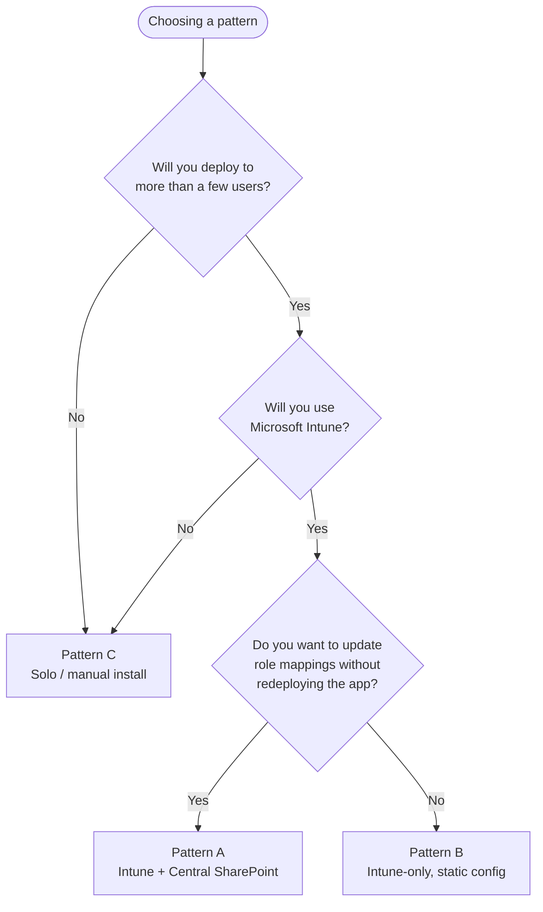

# Setup — `entra-shared-mailbox-manager`

> This is the deployment runbook for an IT administrator standing the tool up in their own Microsoft 365 tenant. It assumes you have read the top-level [`README.md`](../README.md) and at least skimmed [`Architecture.md`](Architecture.md) — particularly section 4 (security model) and section 8 (deployment patterns), because the choices below make more sense in that context.

> [!IMPORTANT]
> **Status: draft / forward-looking.** Several steps in this runbook refer to artifacts that ship with the v1 release (`SharedMailboxTool.msix`, `SharedMailboxTool.ConfigBuilder.exe`, the `scripts/Setup-EntraApp.ps1` helper, the `scripts/Setup-ExchangeRBAC.ps1` helper). Those artifacts do not exist yet — the v1 codebase is under active development. Sections that depend on a v1 artifact are marked with a `⏳ Pending v1 release` callout, and the manual procedure is documented alongside so you can still complete the deployment by hand if you want to evaluate the architecture today. When the v1 release is published, the manual procedures remain valid; the helpers just automate the click-heavy bits.

---

## 1. Audience and prerequisites

### 1.1 Who this runbook is for

A Microsoft 365 administrator with the following roles, at minimum, in the target tenant:

- **Global Administrator** *or* **Cloud Application Administrator** — to create the Entra app registration and grant admin consent.
- **Exchange Administrator** — to create Exchange RBAC role groups and management scopes (only required if you plan to use the delegated-administration model in Pattern A, which is the entire point of the tool; see section 3.4).
- **SharePoint Administrator** *or* site owner of the target SharePoint site — to host the central configuration file (Pattern A only).
- **Intune Administrator** — to assign the MSIX and the bootstrap PowerShell script to user/device groups (Patterns A and B).

If you do not personally hold all of the above, the runbook can be split across operators. The Entra and Exchange steps must happen first; SharePoint and Intune can happen in either order after that.

### 1.2 Tooling you'll need on your admin workstation

- **PowerShell 7.x** — for `Connect-ExchangeOnline`, `Connect-MgGraph`, and the helper scripts.
- **Microsoft.Graph PowerShell module** — `Install-Module Microsoft.Graph -Scope CurrentUser`
- **ExchangeOnlineManagement PowerShell module** — `Install-Module ExchangeOnlineManagement -Scope CurrentUser`
- **Microsoft Intune admin center access** — https://intune.microsoft.com
- **Microsoft Entra admin center access** — https://entra.microsoft.com
- **A text editor** for hand-editing JSON config files. VS Code is fine.

### 1.3 Information you'll need to gather before starting

- **Tenant ID** — find at https://entra.microsoft.com → Overview. Looks like a GUID.
- **The Entra security groups that represent your delegated roles** — e.g., one group per team (`ROLE-ProjectManagers`, `ROLE-OpsLeads`). If these don't exist yet, create them in Entra → Groups → New group → Security group, and populate with the users who should hold each role.
- **The Entra security groups that list each team's shared mailboxes** — these are your `SharedMail-` groups in the convention the v1 script used (e.g., `SharedMail-PM-Mailboxes`). If you don't already organize shared mailboxes this way, see section 3.3 for the structuring recommendation.
- **A SharePoint site you control** — Pattern A only. A new site dedicated to IT operations works well; the central config will live in a document library on this site.

---

## 2. Choose your deployment pattern



Most enterprises should choose **Pattern A**. The SharePoint hosting requirement is a one-time, ~5-minute setup task that pays for itself the first time you need to add a new team to the role mapping without redeploying through Intune. Pattern B is for environments with a policy against application configuration hosted outside Intune. Pattern C is for evaluating the tool, contributing to the project, or one-off installs.

---

## 3. Common one-time tenant setup

Sections 3.1 through 3.4 apply to **all three deployment patterns**. Patterns diverge starting at section 4.

### 3.1 Create the Entra app registration

The tool authenticates each user interactively against this app registration. It is single-tenant by default (only your users can sign in) and requests **delegated permissions only** — no application permissions, no client secret, no certificate.

> ⏳ **Pending v1 release:** `scripts/Setup-EntraApp.ps1` will automate this section idempotently. The manual procedure below remains valid.

**Manual procedure:**

1. Go to https://entra.microsoft.com → **Applications** → **App registrations** → **+ New registration**.
2. **Name:** `Shared Mailbox Manager` (or any name that helps your users recognize the consent prompt).
3. **Supported account types:** *Accounts in this organizational directory only (Single tenant)*.
4. **Redirect URI:** select **Public client/native (mobile & desktop)** and enter `http://localhost`. This is the standard MSAL desktop redirect.
5. Click **Register**.
6. On the resulting **Overview** page, record the **Application (client) ID** and **Directory (tenant) ID** — you'll need both for the bootstrap config later.
7. Go to **API permissions** → **+ Add a permission** → **Microsoft Graph** → **Delegated permissions**. Add the following:
    - `Group.Read.All`
    - `User.Read.All`
    - `Files.Read.All`
8. Click **Grant admin consent for [your tenant]** and confirm. The three permissions should show "Granted for [tenant]" in green.
9. Go to **Authentication** → **Advanced settings** → set **Allow public client flows** to **Yes**. (Required for the MSAL interactive desktop flow.)

**No client secret, no certificate, no application permissions.** If you find yourself adding any of these, stop — you are configuring the wrong shape of app. The tool's security model depends on the app having no standing privileges (see [Architecture.md §5.3](Architecture.md#53-the-no-service-principal-with-standing-privileges-stance)).

### 3.2 Verify the consent surface

Sign in to https://myapps.microsoft.com and confirm the new app registration appears under "My apps" for your test user (it should, immediately after admin consent). If it does not, the consent did not go through; revisit section 3.1 step 8.

### 3.3 Define your role-to-scope mapping

Before you can configure the tool, decide *who can manage what*. The model the tool expects:

- **Roles** are Entra security groups whose members are the people authorized to administer some subset of shared mailboxes. Convention: `ROLE-<TeamName>` (e.g., `ROLE-ProjectManagers`).
- **Scopes** are subsets of shared mailboxes, identified by Exchange `CustomAttribute1` value. Convention: a short uppercase tag per team (`PM`, `OPS`, `HR`, etc.).
- **Mapping**: each role maps to one or more scopes.

A worked example, for a fictional `ROLE-ProjectManagers` who can administer the team's project mailboxes:

| Entra security group | CustomAttribute1 values | Mailboxes covered |
|---|---|---|
| `ROLE-ProjectManagers` | `PM` | Every shared mailbox tagged `CustomAttribute1 = PM` |
| `ROLE-OpsLeads` | `OPS` | Every shared mailbox tagged `CustomAttribute1 = OPS` |
| `ROLE-Helpdesk` | `PM`, `OPS`, `HR` | Every shared mailbox tagged with any of those three values |

If you have not previously used `CustomAttribute1` on your shared mailboxes, you'll need to tag them once. For a single mailbox:

```powershell
Connect-ExchangeOnline
Set-Mailbox -Identity "pm-team@contoso.com" -CustomAttribute1 "PM"
```

For bulk tagging by some other property (display name pattern, distribution group membership, etc.) the v1 product will surface a tagging UI for administrators. For now, a quick loop works:

```powershell
$pmMailboxes = @(
    "pm-team@contoso.com",
    "project-alpha@contoso.com",
    "project-beta@contoso.com"
)
foreach ($mbx in $pmMailboxes) {
    Set-Mailbox -Identity $mbx -CustomAttribute1 "PM"
}
```

Record your role-to-scope mapping; you'll plug it into the configuration file later.

### 3.4 (Optional but strongly recommended) Configure Exchange RBAC

This section sets up the **platform-enforced** half of the dual-layer security model. Without it, the tool's UI filtering still works — but a user with elevated Exchange admin rights could bypass it by going to Admin Center directly. With it, the platform itself refuses unauthorized operations regardless of how they are issued. See [Architecture.md §6.1](Architecture.md#61-layer-1--platform-enforced-exchange-online-rbac) for why this matters.

> ⏳ **Pending v1 release:** `scripts/Setup-ExchangeRBAC.ps1` will take a JSON definition of your roles and create everything below in one pass. The manual procedure remains the canonical reference.

**Manual procedure** — repeat for each role you defined in section 3.3.

For each role, you create three things: a custom management scope, a custom role group bound to that scope, and a membership link from the Entra security group to the role group.

```powershell
Connect-ExchangeOnline

# Example: configure the ROLE-ProjectManagers role with CustomAttribute1='PM'

# 1. Create the management scope (filters to shared mailboxes tagged PM).
New-ManagementScope `
    -Name "Scope-SharedMail-PM" `
    -RecipientRestrictionFilter "RecipientTypeDetails -eq 'SharedMailbox' -and CustomAttribute1 -eq 'PM'"

# 2. Create the role group, bound to that scope, with the minimum
#    recipient-management role.
New-RoleGroup `
    -Name "RoleGroup-SharedMail-PM-Managers" `
    -Roles "Mail Recipients" `
    -CustomRecipientWriteScope "Scope-SharedMail-PM"

# 3. Add the Entra security group as a member of the role group.
Add-RoleGroupMember `
    -Identity "RoleGroup-SharedMail-PM-Managers" `
    -Member "ROLE-ProjectManagers"
```

After running the above for every role, validate by signing in as a member of one of the Entra groups and trying to run `Get-Mailbox` against a mailbox *outside* your scope. Exchange should refuse the operation.

---

## 4. Pattern A — Intune + Central SharePoint (recommended)

You have completed sections 3.1–3.4. Now you configure the central SharePoint config, build the bootstrap config, and deploy via Intune.

### 4.1 Host the central configuration file in SharePoint

1. Open or create a SharePoint Online site dedicated to IT operations. A communications site works well. Limit edit permissions to your IT admin group.
2. In that site, create a document library named `App Configuration` (or any name you prefer).
3. Restrict edit permissions on the library: **Library settings** → **Permissions for this document library** → **Stop inheriting permissions** → grant **Edit** only to your IT admin group, **Read** to everyone who will run the tool.
4. Upload a file named `central-config.json` with the following template, edited for your tenant:

    ```jsonc
    {
      "schemaVersion": 1,
      "sharedMailGroups": [
        {
          "entraGroupId": "<group-id-from-Entra>",
          "displayName": "SharedMail-PM-Mailboxes"
        }
      ],
      "roles": [
        {
          "entraGroupId": "<ROLE-ProjectManagers-group-id>",
          "displayName": "Project Managers",
          "mailboxScope": {
            "matchType": "CustomAttribute1",
            "values": ["PM"]
          }
        },
        {
          "entraGroupId": "<ROLE-OpsLeads-group-id>",
          "displayName": "Ops Leads",
          "mailboxScope": {
            "matchType": "CustomAttribute1",
            "values": ["OPS"]
          }
        }
      ],
      "auditPolicy": {
        "defaultIncludeSendAs": true,
        "blockedDelegateCleanupRequiresConfirmation": true
      },
      "configCacheTtlHours": 24
    }
    ```

5. Open the uploaded file and copy its **direct link**. In SharePoint, click the file → **...** menu → **Details** → **Path** (or right-click → **Copy link** → **Anyone with existing access**). The result will look like `https://contoso.sharepoint.com/sites/ITOps/App%20Configuration/central-config.json`. Record this URL — it becomes the `CentralConfigUrl` in the next section.

### 4.2 Prepare the bootstrap configuration

The bootstrap config is the small local JSON that tells each running instance of the app what tenant it lives in and where to fetch the central config. Save the following as `bootstrap-config.json`, edited for your tenant:

```json
{
  "tenantId": "<tenant-id>",
  "clientId": "<client-id-from-section-3.1>",
  "centralConfigUrl": "<URL-from-section-4.1-step-5>"
}
```

The deploying admin keeps this file under source control inside their IT admin SharePoint site or a private repo. It contains no secrets — but it is tenant-specific and should not be shared publicly.

### 4.3 Deploy the MSIX via Intune

> ⏳ **Pending v1 release:** the `SharedMailboxTool.msix` artifact will be published to the GitHub Releases page once the v1 codebase ships. Section 4.3 will then become applicable.

When the MSIX is available:

1. In the Intune admin center, go to **Apps** → **Windows** → **+ Add** → **Line-of-business app**.
2. Upload `SharedMailboxTool.msix`. Fill in publisher (`Jon Campbell`), name, description, and optionally an icon.
3. Assign to the user groups who will use the tool. **Assignment type: Required**.
4. Save and wait for the assignment to propagate (typically minutes; up to several hours in larger tenants).

### 4.4 Deploy the bootstrap script via Intune

The bootstrap config is delivered to each device by a small PowerShell script run by Intune's "Scripts and remediations" feature.

Save the following as `Deploy-AppConfig.ps1`, with the JSON inlined from section 4.2:

```powershell
# Deploys the bootstrap config to %ProgramData%\SharedMailboxTool\config.json
# Run by Intune as SYSTEM. Idempotent — safe to re-run on every device check-in.

$ErrorActionPreference = "Stop"

$configDir  = Join-Path $env:ProgramData "SharedMailboxTool"
$configPath = Join-Path $configDir "config.json"

if (-not (Test-Path $configDir)) {
    New-Item -ItemType Directory -Path $configDir -Force | Out-Null
}

$config = @{
    tenantId         = "<tenant-id>"
    clientId         = "<client-id>"
    centralConfigUrl = "<central-config-url>"
}

$config | ConvertTo-Json -Depth 10 | Set-Content -Path $configPath -Encoding UTF8

# Make the config readable to all local users (no ACL hardening — config is non-secret)
$acl = Get-Acl $configPath
$rule = New-Object System.Security.AccessControl.FileSystemAccessRule(
    "Users", "Read", "Allow"
)
$acl.AddAccessRule($rule)
Set-Acl -Path $configPath -AclObject $acl

Write-Host "Bootstrap config written to $configPath"
```

In Intune:

1. **Devices** → **Scripts and remediations** → **Platform: Windows** → **+ Add** → **Platform script**.
2. Upload `Deploy-AppConfig.ps1`.
3. **Run this script using the logged-on credentials:** No.
4. **Enforce script signature check:** No (unless you sign your internal scripts).
5. **Run script in 64-bit PowerShell:** Yes.
6. Assign to the same user/device groups as the MSIX. Save.

### 4.5 Verify on a target device

After both assignments have propagated:

1. Sign in to a target device as a user who is a member of one of the `ROLE-` groups.
2. Confirm `%ProgramData%\SharedMailboxTool\config.json` exists and contains the expected `tenantId`, `clientId`, and `centralConfigUrl`.
3. Launch the Shared Mailbox Tool from the Start menu.
4. Complete the interactive sign-in. The app should request consent (already granted at the tenant level in section 3.1) and proceed.
5. Confirm the mailbox picker lists only mailboxes the user's roles allow, per your section 3.3 mapping.

If the mailbox picker is empty: check that the user is a member of at least one `ROLE-` group, that the role is present in `central-config.json`, that mailboxes are tagged with the expected `CustomAttribute1` value, and that the user can `Get-Mailbox` on at least one of those mailboxes from PowerShell (which validates the Exchange RBAC half).

---

## 5. Pattern B — Intune, static config

Identical to Pattern A except step 4.1 is skipped and step 4.4 deploys the operational data (role mappings, group lists) inline instead of as a `centralConfigUrl`.

The `Deploy-AppConfig.ps1` script becomes:

```powershell
$config = @{
    tenantId         = "<tenant-id>"
    clientId         = "<client-id>"
    centralConfigUrl = $null   # Pattern B: no central fetch
    sharedMailGroups = @(
        @{ entraGroupId = "<group-id>"; displayName = "SharedMail-PM-Mailboxes" }
    )
    roles = @(
        @{
            entraGroupId  = "<ROLE-ProjectManagers-group-id>"
            displayName   = "Project Managers"
            mailboxScope  = @{ matchType = "CustomAttribute1"; values = @("PM") }
        }
    )
    auditPolicy = @{
        defaultIncludeSendAs = $true
        blockedDelegateCleanupRequiresConfirmation = $true
    }
}
```

Every role-mapping change is a script update + Intune reassignment. Tolerable for small, static deployments; tedious at scale.

---

## 6. Pattern C — Solo / manual install

For individual administrators evaluating the tool, contributors, or environments without Intune.

> ⏳ **Pending v1 release:** the MSIX install step and the first-run wizard are part of the v1 binary. Until that ships, the closest equivalent is to run the v1 legacy PowerShell script directly — see [`../legacy/README.md`](../legacy/README.md).

Anticipated flow once v1 ships:

1. Download `SharedMailboxTool.msix` from the GitHub Releases page.
2. Install: `Add-AppxPackage -Path .\SharedMailboxTool.msix`
3. Launch the app from the Start menu.
4. On first launch with no config present, the first-run wizard opens. Provide:
    - Tenant ID
    - Client ID of the Entra app registration (created per section 3.1)
    - Optionally, a central config URL (for shared use across your own workstations)
    - Or paste/edit role mappings directly into the per-user config the wizard writes.
5. The wizard writes the config to `%AppData%\SharedMailboxTool\config.json` and proceeds to the main UI.

---

## 7. Updating configuration after initial deployment

How you make changes after the initial deployment depends on which pattern you chose.

| Change | Pattern A | Pattern B | Pattern C |
|---|---|---|---|
| Add a new role | Edit `central-config.json` in SharePoint, save. Picked up on next launch. | Edit `Deploy-AppConfig.ps1`, reassign in Intune. | Edit `%AppData%\SharedMailboxTool\config.json`, restart app. |
| Change a role's scope | Same | Same | Same |
| Add a `SharedMail-` group | Same | Same | Same |
| Change `tenantId` or `clientId` | Re-run section 4.4 with new bootstrap script | Same | Re-run first-run wizard |

Pattern A's most appealing property is captured in the first three rows: edit JSON in a browser, save, done.

### 7.1 Cache invalidation in Pattern A

When the central config changes, running app instances pick it up the next time they launch. The configurable cache TTL (`configCacheTtlHours`, default 24h) controls how long a stale cache is acceptable if the SharePoint fetch fails on next launch. To force-refresh immediately on a specific device, delete `%LocalAppData%\SharedMailboxTool\central-config.cache.json` and relaunch the app.

---

## 8. Verification and smoke tests

After any deployment or config change, run these checks. They are quick and catch the vast majority of misconfigurations.

### 8.1 Identity smoke test

Sign in to the app as a user who is *not* a member of any `ROLE-` group. Expected: a clear "no roles assigned" empty-state message in the UI, no error dialog, no crash, no permission requests beyond the initial Graph consent.

### 8.2 Scope-isolation smoke test

Sign in as a member of a single `ROLE-` group, then attempt to manipulate a mailbox outside that role's scope (you can use the v1 PowerShell `Add-MailboxPermission` or the Admin Center, signed in as the same user). Expected: Exchange Online refuses the operation. *This validates the platform-enforced security layer.*

### 8.3 Audit-export smoke test

Run an audit against one mailbox the role covers. Expected: a CSV in `%LocalAppData%\SharedMailboxTool\logs\` matching the v1 filename pattern (`mailbox-audit-YYYYMMDD-HHMMSS.csv`), one row per trustee, with the expected columns (Mailbox, Trustee, DisplayName, AccountEnabled, SignInBlocked, FullAccess, SendAs, SendOnBehalf, LookupStatus).

### 8.4 Bulk-grant dry-run smoke test

Initiate a bulk grant against one `SharedMail-` group with one user. *Do not click Apply.* Expected: the preview pane shows the full (user × mailbox × permission) matrix, with rows annotated for "will add" vs "already present". Cancelling at this stage performs no writes.

---

## 9. Troubleshooting

### 9.1 "AADSTS65001: The user or administrator has not consented to use the application"

Section 3.1 step 8 was not completed (admin consent). Return to the Entra admin center and grant consent.

### 9.2 "AADSTS50194: Application is configured for use by Microsoft accounts only"

Section 3.1 step 3: app registration was created with the wrong account-type setting. Change **Supported account types** to *Single tenant* (or *Multitenant* if intentional) and retry.

### 9.3 Mailbox picker is empty for a user who should see mailboxes

In order, check:

1. The user is a member of at least one `ROLE-` group (`Get-MgUserMemberOf -UserId <upn>`).
2. That group is present in the current config (`central-config.json` or local bootstrap).
3. Mailboxes the role should cover are tagged with the expected `CustomAttribute1` value (`Get-Mailbox <mbx> | Select CustomAttribute1`).
4. The user can `Get-Mailbox` against one of those mailboxes from PowerShell. If not, the Exchange RBAC role group from section 3.4 is misconfigured or the user isn't in the right Entra group.

### 9.4 "Failed to fetch central config"

The app falls back to the cached config (or to bootstrap-only). To diagnose:

1. Confirm the URL in `bootstrap-config.json` resolves in a browser, signed in as the same user.
2. Confirm the user has at least Read on the SharePoint library hosting the file.
3. Confirm the file is named exactly as the URL references it (case-sensitive on SharePoint paths after the site path).
4. Check the app's Serilog output at `%LocalAppData%\SharedMailboxTool\logs\app-YYYYMMDD.log` for the specific Graph error code returned.

### 9.5 "Connect-ExchangeOnline" prompts repeatedly

The Exchange Online module's token cache lives outside MSAL and has its own behaviour. On first run after install, a `Connect-ExchangeOnline` consent prompt is expected. If it recurs every launch, ensure the user's profile is not roaming-deleted between sessions (a domain policy issue, not an app issue).

### 9.6 Intune script ran but no config file appeared

Check Intune's script run status under **Devices** → **Scripts and remediations** → **(your script)** → **Device status**. Most common failures: the device is offline at check-in time (will retry on next sync), or PowerShell execution policy on the device blocks unsigned scripts (set the script to use 64-bit PowerShell, which uses LocalMachine policy rather than per-user).

---

## 10. Uninstalling

### 10.1 Remove the app

If deployed via Intune: change the assignment from **Required** to **Uninstall** for the target user/device group. Intune will pull the MSIX and the app will be removed on next sync.

If installed manually: `Get-AppxPackage *SharedMailboxTool* | Remove-AppxPackage`

### 10.2 Remove the config and local state

```powershell
Remove-Item -Path "$env:ProgramData\SharedMailboxTool" -Recurse -Force -ErrorAction SilentlyContinue
Remove-Item -Path "$env:AppData\SharedMailboxTool" -Recurse -Force -ErrorAction SilentlyContinue
Remove-Item -Path "$env:LocalAppData\SharedMailboxTool" -Recurse -Force -ErrorAction SilentlyContinue
```

### 10.3 Remove tenant-side artifacts

Only do this if you are decommissioning the tool entirely.

```powershell
# Entra app registration (use the Object ID from the Overview page).
Connect-MgGraph -Scopes "Application.ReadWrite.All"
Remove-MgApplication -ApplicationId "<object-id>"

# Exchange RBAC primitives (one role's worth shown; repeat per role).
Connect-ExchangeOnline
Remove-RoleGroupMember -Identity "RoleGroup-SharedMail-PM-Managers" -Member "ROLE-ProjectManagers"
Remove-RoleGroup -Identity "RoleGroup-SharedMail-PM-Managers"
Remove-ManagementScope -Identity "Scope-SharedMail-PM"

# The CustomAttribute1 tags on shared mailboxes are harmless to leave behind
# but can be cleared if you wish:
Get-Mailbox -RecipientTypeDetails SharedMailbox -ResultSize Unlimited |
    Where-Object { $_.CustomAttribute1 -in @("PM","OPS","HR") } |
    Set-Mailbox -CustomAttribute1 $null
```

The SharePoint document library hosting `central-config.json` can be deleted from SharePoint directly, or left in place if you prefer to keep the history.

---

## 11. Next steps after a successful deployment

- Pin the app to the Start menu for your target users (Intune can do this via a Start menu layout policy).
- Set a calendar reminder to review the `Receipts/` directory contents quarterly. They are the canonical record of what the tool was used for.
- If you operate a SIEM, point an ingestor at `%LocalAppData%\SharedMailboxTool\logs\` to capture the Serilog JSON output.
- Forward feedback and bug reports to the [project issues page](https://github.com/JohnnyPitchfork/entra-shared-mailbox-manager/issues) (once the v1 codebase ships).

---

*This runbook will evolve alongside the v1 codebase. Any divergence between this document and observed tool behaviour is a documentation bug — please open an issue.*
